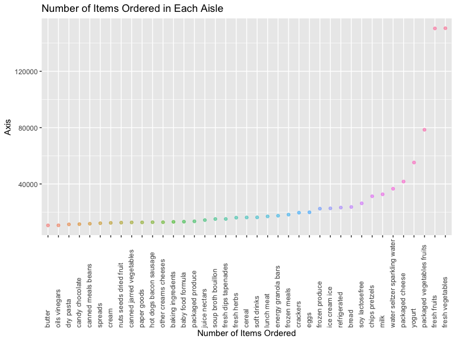
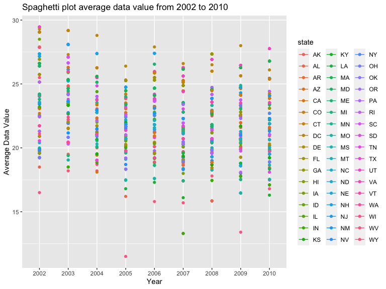
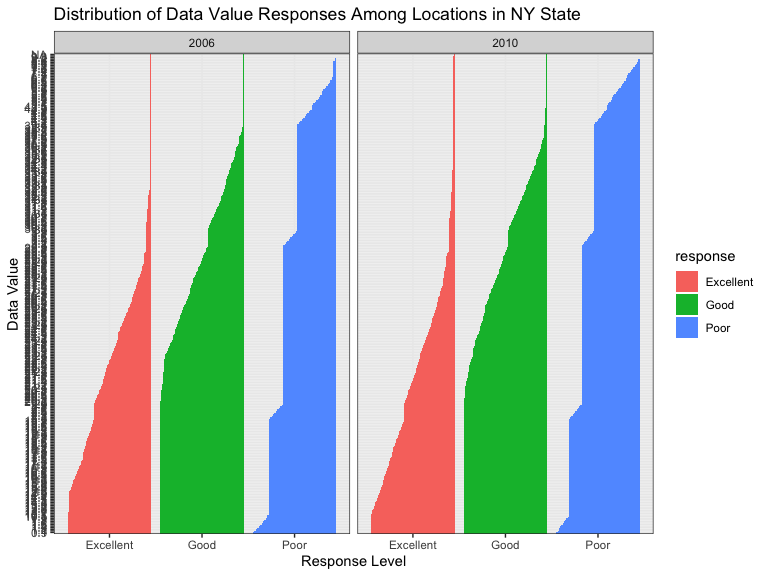
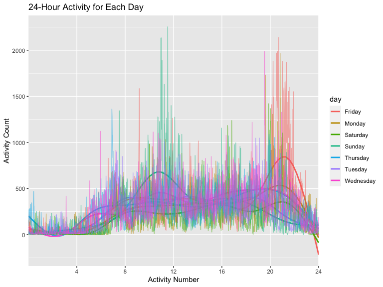

Homework 3 for Data Science, P8105 Kiana Chan
================

``` r
library(tidyverse)
```

    ## ── Attaching packages ─────────────────────────────────────── tidyverse 1.3.1 ──

    ## ✓ ggplot2 3.3.5     ✓ purrr   0.3.4
    ## ✓ tibble  3.1.4     ✓ dplyr   1.0.7
    ## ✓ tidyr   1.1.3     ✓ stringr 1.4.0
    ## ✓ readr   2.0.1     ✓ forcats 0.5.1

    ## ── Conflicts ────────────────────────────────────────── tidyverse_conflicts() ──
    ## x dplyr::filter() masks stats::filter()
    ## x dplyr::lag()    masks stats::lag()

``` r
library(dplyr)
library(readxl)
knitr::opts_chunk$set(
    echo = TRUE, 
    warning = FALSE, 
    fig.width = 8, 
    fig.height = 6, 
    out.width = "90%"
)
```

\#PROBLEM 1 \* Part 1: The goal is to do some exploration of this
dataset. To that end, write a short description of the dataset, noting
the size and structure of the data, describing some key variables, and
giving illstrative examples of observations. Then, do or answer the
following (commenting on the results of each): *Part 2: How many aisles
are there, and which aisles are the most items ordered from? *Part 3:
Make a plot that shows the number of items ordered in each aisle,
limiting this to aisles with more than 10000 items ordered. Arrange
aisles sensibly, and organize your plot so others can read it. *Part 4:
Make a table showing the three most popular items in each of the aisles
“baking ingredients”, “dog food care”, and “packaged vegetables fruits”.
Include the number of times each item is ordered in your table. *Part 5:
take a table showing the mean hour of the day at which Pink Lady Apples
and Coffee Ice Cream are ordered on each day of the week; format this
table for human readers (i.e. produce a 2 x 7 table).

Load the Instacart data:

``` r
library(p8105.datasets)
data("instacart")
```

## Part 1: Description of “Instacart” dataset: This data contains 1384617 total observations. Some key variables include order ID, product ID, order number, and product name, describing the various instacart orders. Some examples of observations in the product\_name category include Bulgarian Yogurt, Spring Water, Organic Half & Half, Asparagus, etc.

## Part 2: How many aisles are there, and which aisles are the most items ordered from?

There are 134 asiles. The aisles that most items are ordered from
include: fresh vegetables, other creams cheeses, fresh fruits, packaged
cheese, and canned meat seafood.

``` r
instacart %>% 
    group_by(aisle) %>% 
    arrange(instacart, desc(aisle))
```

    ## # A tibble: 1,384,617 × 15
    ## # Groups:   aisle [134]
    ##    order_id product_id add_to_cart_order reordered user_id eval_set order_number
    ##       <int>      <int>             <int>     <int>   <int> <chr>           <int>
    ##  1        1      10246                 3         0  112108 train               4
    ##  2        1      11109                 2         1  112108 train               4
    ##  3        1      13176                 6         0  112108 train               4
    ##  4        1      22035                 8         1  112108 train               4
    ##  5        1      43633                 5         1  112108 train               4
    ##  6        1      47209                 7         0  112108 train               4
    ##  7        1      49302                 1         1  112108 train               4
    ##  8        1      49683                 4         0  112108 train               4
    ##  9       36      19660                 2         1   79431 train              23
    ## 10       36      34497                 6         1   79431 train              23
    ## # … with 1,384,607 more rows, and 8 more variables: order_dow <int>,
    ## #   order_hour_of_day <int>, days_since_prior_order <int>, product_name <chr>,
    ## #   aisle_id <int>, department_id <int>, aisle <chr>, department <chr>

count month / name observations

``` r
instacart %>% 
  group_by(aisle) %>%
  summarize(n_obs = n())
```

    ## # A tibble: 134 × 2
    ##    aisle                  n_obs
    ##    <chr>                  <int>
    ##  1 air fresheners candles  1067
    ##  2 asian foods             7007
    ##  3 baby accessories         306
    ##  4 baby bath body care      328
    ##  5 baby food formula      13198
    ##  6 bakery desserts         1501
    ##  7 baking ingredients     13088
    ##  8 baking supplies decor   1094
    ##  9 beauty                   287
    ## 10 beers coolers           1839
    ## # … with 124 more rows

``` r
instacart %>% 
  count(aisle, name = "n_obs")
```

    ## # A tibble: 134 × 2
    ##    aisle                  n_obs
    ##    <chr>                  <int>
    ##  1 air fresheners candles  1067
    ##  2 asian foods             7007
    ##  3 baby accessories         306
    ##  4 baby bath body care      328
    ##  5 baby food formula      13198
    ##  6 bakery desserts         1501
    ##  7 baking ingredients     13088
    ##  8 baking supplies decor   1094
    ##  9 beauty                   287
    ## 10 beers coolers           1839
    ## # … with 124 more rows

``` r
  arrange(instacart, desc(aisle))
```

    ## # A tibble: 1,384,617 × 15
    ##    order_id product_id add_to_cart_order reordered user_id eval_set order_number
    ##       <int>      <int>             <int>     <int>   <int> <chr>           <int>
    ##  1        1      49302                 1         1  112108 train               4
    ##  2       98      43654                 3         1   56463 train              41
    ##  3      170       8153                 6         0  182389 train               7
    ##  4      631       9203                13         1  184099 train               7
    ##  5      631      15842                14         1  184099 train               7
    ##  6      878      23044                 3         0   61911 train               9
    ##  7      915      19977                11         0  166117 train               4
    ##  8     1032      11063                 1         1  164808 train              18
    ##  9     1145      47409                 9         1  127134 train              10
    ## 10     1145       5069                17         1  127134 train              10
    ## # … with 1,384,607 more rows, and 8 more variables: order_dow <int>,
    ## #   order_hour_of_day <int>, days_since_prior_order <int>, product_name <chr>,
    ## #   aisle_id <int>, department_id <int>, aisle <chr>, department <chr>

## Part 3: Make a plot that shows the number of items ordered in each aisle, limiting this to aisles with more than 10000 items ordered. Arrange aisles sensibly, and organize your plot so others can read it.

``` r
instacart %>% 
  count(aisle) %>% 
  filter(n > 10000) %>% 
  mutate(aisle = fct_reorder(aisle, n)) %>% 
   ggplot(aes(x = aisle, y = n, color = aisle)) + 
    geom_point(alpha = .5) + 
    labs(
        title = "Aisle Plot", 
        x = "Number of Items Ordered", 
        y = "Axis") + 
    
    theme(
      axis.text.x = element_text(angle = 90, hjust = 0, vjust = .35), 
      legend.position = "none" 
    )
```



\#\#Part 4: Make a table showing the three most popular items in each of
the aisles “baking ingredients”, “dog food care”, and “packaged
vegetables fruits”. Include the number of times each item is ordered in
your table.

``` r
popular_items = 
instacart %>%     
    filter(aisle == c("baking ingredients", "dog food care", "packaged vegetables fruits")) %>% 
    group_by(aisle) %>% 
    count(product_name) %>% 
    mutate(rank = rank(desc(n))) %>% 
    filter(rank < 4) %>% 
    select(-product_name) %>% 
  arrange(rank)
      knitr::kable(popular_items, 
                   caption = "Top 3 Items",
                   format = "simple", 
                   col.names = str_to_title(names(popular_items)), 
                   align = "lcc")
```

| Aisle                      |  N   | Rank |
|:---------------------------|:----:|:----:|
| baking ingredients         | 157  |  1   |
| dog food care              |  14  |  1   |
| packaged vegetables fruits | 3324 |  1   |
| baking ingredients         | 140  |  2   |
| dog food care              |  13  |  2   |
| packaged vegetables fruits | 1920 |  2   |
| baking ingredients         | 122  |  3   |
| dog food care              |  9   |  3   |
| packaged vegetables fruits | 1692 |  3   |

Top 3 Items

\#\#Make a table showing the mean hour of the day at which Pink Lady
Apples and Coffee Ice Cream are ordered on each day of the week; format
this table for human readers (i.e. produce a 2 x 7 table).

``` r
instacart %>%
    group_by(product_name, order_dow) %>% 
    filter(product_name %in% c("Pink Lady Apples", "Coffee Ice Cream")) %>% 
    summarize(mean_hour = mean(order_hour_of_day)) %>% 
pivot_wider(
    names_from = "order_dow", 
    values_from = "mean_hour") %>% 
  
knitr::kable(
    digits = 2,
    caption = "Figure: Mean Hour of Day at Which Pink Lady Apples and Coffee Ice Cream are Ordered Each Day of Week"
)
```

    ## `summarise()` has grouped output by 'product_name'. You can override using the `.groups` argument.

| product\_name    |     0 |     1 |     2 |     3 |     4 |     5 |     6 |
|:-----------------|------:|------:|------:|------:|------:|------:|------:|
| Coffee Ice Cream | 13.77 | 14.32 | 15.38 | 15.32 | 15.22 | 12.26 | 13.83 |
| Pink Lady Apples | 13.44 | 11.36 | 11.70 | 14.25 | 11.55 | 12.78 | 11.94 |

Figure: Mean Hour of Day at Which Pink Lady Apples and Coffee Ice Cream
are Ordered Each Day of Week

\#Problem 2 First, do some data cleaning: \* format the data to use
appropriate variable names; \* focus on the “Overall Health” topic \*
include only responses from “Excellent” to “Poor” \* organize responses
as a factor taking levels ordered from “Poor” to “Excellent”

# install.packages(“devtools”)

``` r
library(p8105.datasets)
data("brfss_smart2010")
```

``` r
library(tidyverse)
library(httr)
library(jsonlite)
```

    ## 
    ## Attaching package: 'jsonlite'

    ## The following object is masked from 'package:purrr':
    ## 
    ##     flatten

``` r
library(dplyr)

var_names = 
  GET("https://chronicdata.cdc.gov/views/acme-vg9e.json") %>%
  content("text") %>%
  fromJSON() %>% 
  .[["columns"]] %>% 
  .[["name"]] %>% 
  .[1:22]

brfss_smart2010 = 
  GET("https://chronicdata.cdc.gov/views/acme-vg9e/rows.json") %>% 
  content("text") %>%
  fromJSON() %>% 
  .[["data"]]

row_as_tibble = function(row_as_list, var_names) {
  var_list = row_as_list[9:30]
  names(var_list) = var_names 
  var_list[sapply(var_list, is.null)] <- NULL
  as_tibble(var_list, validate = FALSE)
}

brfss_smart2010 = 
  brfss_smart2010 %>% 
  map(.x = ., ~row_as_tibble(.x, var_names)) %>% 
  bind_rows
```

First, do some data cleaning: \* format the data to use appropriate
variable names; \* focus on the “Overall Health” topic \* include only
responses from “Excellent” to “Poor” \* organize responses as a factor
taking levels ordered from “Poor” to “Excellent”

## Data Cleaning

``` r
cleaned_brfss = brfss_smart2010 %>% 
  janitor::clean_names() %>% 
  filter(topic == "Overall Health", 
         response %in% c("Excellent", "Very Good", "Good", "Poor")) %>% 
  mutate(response = as_factor(response)) %>% 
  arrange(desc(response))
```

\*In 2002, which states were observed at 7 or more locations? What about
in 2010?

## In 2002, states that were observed at 7 or more locations include AK, AL, CA, AZ, GA, etc. There were 49 states in total that were observed at 7 or more locations in 2002.

``` r
brfss_in2002 = cleaned_brfss %>%  
  rename(state = locationabbr) %>% 
  filter(year == "2002") %>% 
  group_by(state) %>% 
  count(state) %>% 
  filter(state >= 7)
```

## In 2002, states that were observed at 10 or more locations AR, AZ, AL, CA, CT, DC, etc. There were 49 states in total that were observed at 10 or more locations.

``` r
brfss_in2010 = cleaned_brfss %>%
  rename(state = locationabbr) %>% 
  filter(year == "2010") %>% 
    group_by(state) %>% 
    count(state) %>% 
  filter(state >= 10)
```

\*Construct a dataset that is limited to Excellent responses, and
contains, year, state, and a variable that averages the data\_value
across locations within a state. Make a “spaghetti” plot of this average
value over time within a state (that is, make a plot showing a line for
each state across years – the geom\_line geometry and group aesthetic
will help).

``` r
brfss_new = cleaned_brfss %>% 
  mutate(data_value = as.numeric(data_value)) %>% 
  rename(state = locationabbr) %>% 
  select(year, state, response, data_value) %>% 
  filter(response == "Excellent") %>% 
  group_by(state, year) %>% 
mutate(
    ave_data_value = mean(data_value)) %>% 
ggplot(aes(x = year, y = ave_data_value, color = state)) + 
    geom_point() + 
    geom_line() + 
    labs(
      title = "Spaghetti plot average data value from 2002 to 2010",
      x = "Year",
      y = "Average Data Value"
    )
brfss_new
```



\*Make a two-panel plot showing, for the years 2006, and 2010,
distribution of data\_value for responses (“Poor” to “Excellent”) among
locations in NY State.

Note: This plot appears fine in the console section but when I knit the
document, it doesn’t appear the same.

``` r
brfss_plot = cleaned_brfss %>% 
  filter(year == "2006" | year == "2010") %>% 
  group_by(year, response)
```

``` r
ggplot(brfss_plot, aes(x = response, y = data_value, fill = response)) +
  geom_col(position = "dodge") +
  labs(x = "Response Level", y = "Data Value", title = "Distribution of Data Value Responses Among Locations in NY State") + 
  theme_bw() + facet_grid(.~year)
```



``` r
  theme(
      axis.text.y = element_text(angle = 90, hjust = 0, vjust = .35), 
      legend.position = "none" 
    )
```

    ## List of 2
    ##  $ axis.text.y    :List of 11
    ##   ..$ family       : NULL
    ##   ..$ face         : NULL
    ##   ..$ colour       : NULL
    ##   ..$ size         : NULL
    ##   ..$ hjust        : num 0
    ##   ..$ vjust        : num 0.35
    ##   ..$ angle        : num 90
    ##   ..$ lineheight   : NULL
    ##   ..$ margin       : NULL
    ##   ..$ debug        : NULL
    ##   ..$ inherit.blank: logi FALSE
    ##   ..- attr(*, "class")= chr [1:2] "element_text" "element"
    ##  $ legend.position: chr "none"
    ##  - attr(*, "class")= chr [1:2] "theme" "gg"
    ##  - attr(*, "complete")= logi FALSE
    ##  - attr(*, "validate")= logi TRUE

\#Problem 3 \*Part 1: Load, tidy, and otherwise wrangle the data. Your
final dataset should include all originally observed variables and
values; have useful variable names; include a weekday vs weekend
variable; and encode data with reasonable variable classes. Describe the
resulting dataset (e.g. what variables exist, how many observations,
etc).

\*Part 2: Traditional analyses of accelerometer data focus on the total
activity over the day. Using your tidied dataset, aggregate accross
minutes to create a total activity variable for each day, and create a
table showing these totals. Are any trends apparent?

\*Part 3: Accelerometer data allows the inspection activity over the
course of the day. Make a single-panel plot that shows the 24-hour
activity time courses for each day and use color to indicate day of the
week. Describe in words any patterns or conclusions you can make based
on this graph.

## Question 3 Part 1

``` r
accel_df = read_csv("./data/accel_data.csv")
```

    ## Rows: 35 Columns: 1443

    ## ── Column specification ────────────────────────────────────────────────────────
    ## Delimiter: ","
    ## chr    (1): day
    ## dbl (1442): week, day_id, activity.1, activity.2, activity.3, activity.4, ac...

    ## 
    ## ℹ Use `spec()` to retrieve the full column specification for this data.
    ## ℹ Specify the column types or set `show_col_types = FALSE` to quiet this message.

``` r
cleaned_accel = accel_df %>% 
janitor::clean_names() 
```

``` r
dataframe.test = 
cleaned_accel %>% 
pivot_longer(
  cols = activity_1:activity_1440, 
  names_to = "activity_number", 
  names_prefix = "activity_", 
  values_to = "activity_count") %>% 
  mutate(
    weekend = (day == "Saturday" | day == "Sunday"))
```

## Question 3 Part 2

\*Part 2: Traditional analyses of accelerometer data focus on the total
activity over the day. Using your tidied dataset, aggregate across
minutes to create a total activity variable for each day, and create a
table showing these totals. Are any trends apparent?

``` r
total_activity = 
    dataframe.test %>% 
  group_by(day_id) %>% 
  summarize(total_activities = sum(activity_count))
#knitr::kable()
total_activity %>% knitr::kable()
```

| day\_id | total\_activities |
|--------:|------------------:|
|       1 |         480542.62 |
|       2 |          78828.07 |
|       3 |         376254.00 |
|       4 |         631105.00 |
|       5 |         355923.64 |
|       6 |         307094.24 |
|       7 |         340115.01 |
|       8 |         568839.00 |
|       9 |         295431.00 |
|      10 |         607175.00 |
|      11 |         422018.00 |
|      12 |         474048.00 |
|      13 |         423245.00 |
|      14 |         440962.00 |
|      15 |         467420.00 |
|      16 |         685910.00 |
|      17 |         382928.00 |
|      18 |         467052.00 |
|      19 |         371230.00 |
|      20 |         381507.00 |
|      21 |         468869.00 |
|      22 |         154049.00 |
|      23 |         409450.00 |
|      24 |           1440.00 |
|      25 |         260617.00 |
|      26 |         340291.00 |
|      27 |         319568.00 |
|      28 |         434460.00 |
|      29 |         620860.00 |
|      30 |         389080.00 |
|      31 |           1440.00 |
|      32 |         138421.00 |
|      33 |         549658.00 |
|      34 |         367824.00 |
|      35 |         445366.00 |

Based on the table, some trends that I can see are that the middle of
the week tends to have lower levels of activity compared to the end of
the week.

## Question 3 Part 3

\*Part 3: Accelerometer data allows the inspection activity over the
course of the day. Make a single-panel plot that shows the 24-hour
activity time courses for each day and use color to indicate day of the
week. Describe in words any patterns or conclusions you can make based
on this graph.

``` r
dataframe.test %>% 
  mutate(activity_number = as.numeric(as.numeric(activity_number))) %>% 
    group_by(day, activity_number) %>% 
    summarize(ave_value = mean(activity_count)) %>% 
    ggplot(aes(x = activity_number, y = ave_value, color = day)) + 
  geom_smooth(se = FALSE) +
    geom_line(alpha = 0.5) + 
    scale_x_discrete(limit = c(240, 480, 720, 960, 1200, 1440), 
      labels = c("4", "8", "12", "16", "20", "24")) +
    labs(
      title = "24-Hour Activity for Each Day",
      x = "Activity Number",
      y = "Activity Count"
    )
```

    ## `summarise()` has grouped output by 'day'. You can override using the `.groups` argument.

    ## `geom_smooth()` using method = 'gam' and formula 'y ~ s(x, bs = "cs")'



# Sunday around noon there is a high level of activity. In addition, you can see from the graph plot that Friday evening also has a high level ofa ctivity. This makes sense because Sunday is the weekend, and Friday evening people tend to go out.
